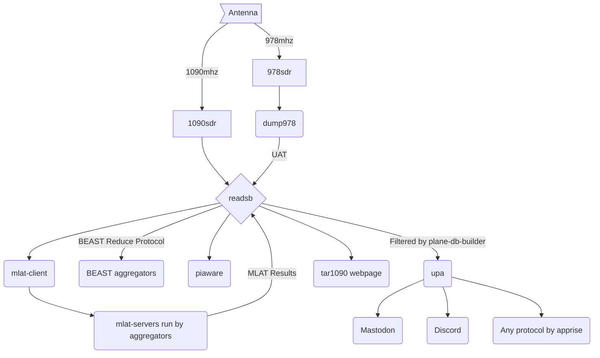

# μADSB

μADSB is a series of minimally privileged docker containers for obtaining ADSB radio signals from airplanes via a SDR and sharing with various services.

- [μreadsb](https://github.com/jquagga/ureadsb) [](https://securityscorecards.dev/viewer/?uri=github.com/jquagga/ureadsb)
- [μ978](https://github.com/jquagga/u978) [](https://securityscorecards.dev/viewer/?uri=github.com/jquagga/u978)
- [μmlat](https://github.com/jquagga/umlat) [](https://securityscorecards.dev/viewer/?uri=github.com/jquagga/umlat)
- [μpa](https://github.com/jquagga/upa) [](https://securityscorecards.dev/viewer/?uri=github.com/jquagga/upa)
- [μpiaware](https://github.com/jquagga/upiaware) [](https://securityscorecards.dev/viewer/?uri=github.com/jquagga/upiaware)
- [μtar1090](https://github.com/jquagga/utar1090) [](https://securityscorecards.dev/viewer/?uri=github.com/jquagga/utar1090)

And while not part of the stack, you may also find these useful:

- [plane-db-builder](https://github.com/jquagga/plane-db-builder) builds a customized list of planes to look out for with upa.
- [polar.sh](https://github.com/jquagga/polar.sh) generates a graphic plot of planes from your feed.

## An overview [^mermaid]



[^mermaid]: This is my first time using a [Mermaid](https://mermaid.js.org/) chart on Github. It's pretty cool!

## Some differences to the Ultrafeeder

I would start by saying that none of these is intended to take away from the hard work the SDR Enthusiasts have done in building their containers. I just wanted things slightly different and it was fun to build up this stack. :-) μADSB attempts to provide functionality similar with the [SDR Enthusiasts ultrafeeder](https://github.com/sdr-enthusiasts/docker-adsb-ultrafeeder), however are focused on minimizing the number of services and permissions required. Let's go through differences off the top of my head.

### Cons of μADSB (why you'd prefer ultrafeeder)

- Presently, **only rtlsdrs are supported directly**. This actually matches ultrafeeder I believe but you can use other containers as you would with ultrafeeder to feed BEAST data into this stack.
- **graphs1090 doesn't exist**. You can use prometheus / grafana if you configure it. One of the goals of this project was to be disk transient. When the stack shuts down, the ram disk is cleared and there isn't any persistant storage locally. As such, graphs1090 doesn't make the most sense here.
- Many of the .env configuration options aren't supported by μADSB. The core is, however esoteric options require direct editing of the docker-compose.yml. I don't think that's a big deal, however worth noting.
- mlathub doesn't exist. The mlat-clients return results directly to readsb so you get the results in tar1090

### Pros of μADSB

- Generally, **one process per container.**[^oneprocess] If it dies, docker just restarts it. No init system; no complicated health checks. Just a linear process.
- All of the containers built on [distroless](https://github.com/GoogleContainerTools/distroless) and **all are non-root other than utar1090**.[^caddy]
- renovatebot keeps the dependencies of everything up to date so the containers should be rebuilt with supporting software updates.
- The containers try to follow best practices. They have **limited permissions, minimized images, OSSF scorecards, pinned digests, signed images and are designed to be straightforward**.
- **They're modular.** Want to add flightradar? Add in the container from SDREnthusists. Don't want piaware or tar1090 running? You can delete the container from docker-compose and the code isn't even there.

[^oneprocess]: Piaware is the notable exception. It starts one process which starts 2-3 more but they all feed FlightAware.
[^caddy]: Caddy needs root from some of the SSL functions but if you run just http1.1, you can configure a non-root user in the docker-compose.

## Usage

If you're already running the sdr-enthusiasts stack, the `build-docker-compose.sh` included in this repository will build a template of a docker-compose.yml with similar settings provided you copy the `.env` file to the same directory to build. This stack doesn't utilize as many environmental variables in configuration, but you can directly configure the docker-compose.yml after the script builds it. Let's walk through basic configuration.

### Mandatory Prerequisite: the udev rules for the SDR

If you've completed the [SDR Enthusiasts docker-install](https://github.com/sdr-enthusiasts/docker-install/tree/main) script, you're already set. If not, you can go through that or install docker yourself and [the udev rules for the SDR](https://github.com/sdr-enthusiasts/docker-install/blob/bf65d9d6b0fa0eda4eb97a43a152ae40bc8d678f/docker-install.sh#L349). The μADSB containers run as user nobody (instead of root) so **if you don't install the rules, the containers won't have permission to open/use the radios.** You probably won't get very far without them.

### The .env file

This stack doesn't support as many of the variables as the sdr-enthusiasts stack, however it does support the following core entries. The bash script in this repository is just a simple find/replace which plugs the variables from your .env file into a docker-compose which is hopefully ready to go. Copy the .env here, run the script and inspect the docker-compose.yml for your liking.

```bash
ADSB_SDR_GAIN=40.2
ADSB_SDR_PPM=13
ADSB_SDR_SERIAL=1090
FEEDER_ALT_M=105.1 #Only Meters is supports at present
FEEDER_LAT=Secret
FEEDER_LONG=-Secret
FEEDER_NAME=Secret
PIAWARE_FEEDER_ID=Secret
ULTRAFEEDER_UUID=Secret
UPA_NOTIFY_URL=mastodons://Secret
UPA_PADATABASE_URL=https://github.com/jquagga/planes/raw/main/planes.csv #By default uses the normal plane alert database
```

### Caddyfile

You'll also probably need to tinker with the Caddyfile to at a minimum, set the ip address of your device. It's set for a basic http, non-encrypted page but Caddy will support tls / http2 and http3 if tls is configured.

## Todo

- Documentation is never enough.

## Contributing

Pull requests are welcome! But, you'd probably want to generate those either in the associated Dockerfile repository or into the upstream project (as readsb, mlat-client, etc are written and maintained by others).
